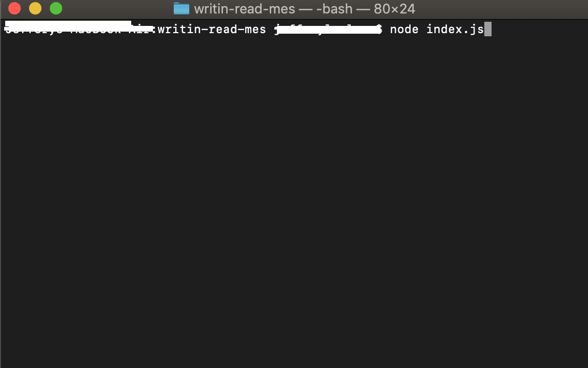
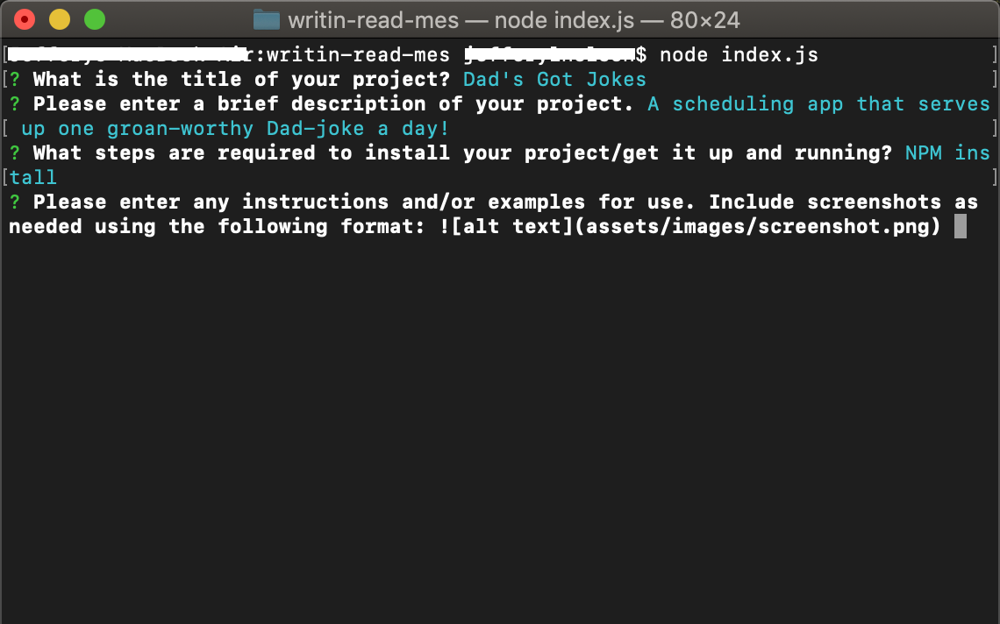
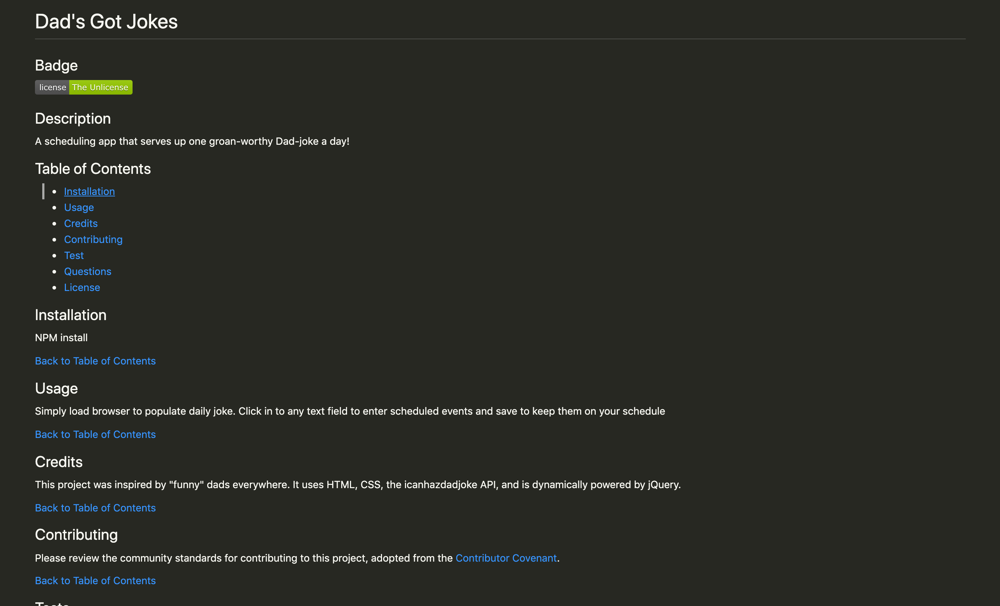
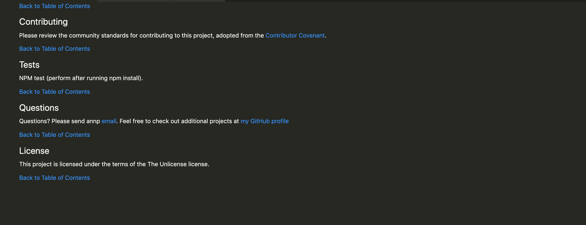

# Writing READMEs

## Badge

## Description

A command-line application for producing high-quality READMEs for your projects.

Watch a demo of Writing READMEs [here.](https://drive.google.com/file/d/1SLfq3WS6d2imb3b9Xi4MvP58fgGGbEZg/view)

## Table of Contents

- [Installation](#Installation)
- [Usage](#Usage)
- [Credits](#Credits)
- [Contributing](#Contributing)
- [Test](#Tests)
- [Questions](#Questions)
- [License](#License)

## Installation

NPM install

[Back to Table of Contents](#table-of-contents)

## Usage

After installing dependencies, initiate the prompts by entering 'node index.js' in the command line. Answer the questions that present in the command line to create your readme content. Edit content for typos/content after markdown generated (if needed)
(Screenshots of fictional app; any resemblance to an existing app is purely coincidental).

Initiating app from command line:

User is asked to provide content for readme:

After questions complete, readme is generated:

[Back to Table of Contents](#table-of-contents)

## Credits

This project uses [Inquirer](https://www.npmjs.com/package/inquirer) and [Node fs](https://www.npmjs.com/package/node-fs) to run questions and write the markdown files, [Shields.io](https://shields.io/category/license) used to generate license badges, and -last but not least- this project is powered by JavaScript.

[Back to Table of Contents](#table-of-contents)

## Contributing

Please review the community standards for contributing to this project, adopted from the [Contributor Covenant](https://www.contributor-covenant.org/).

[Back to Table of Contents](#table-of-contents)

## Tests

No tests at this time.

[Back to Table of Contents](#table-of-contents)

## Questions

Questions? You can reach me by email at jennifer.nelson242@gmail.com. Feel free to check out additional projects at [my GitHub profile](https://github.com/jnel-221).

[Back to Table of Contents](#table-of-contents)

## License

This project is licensed under the terms of the MIT license.

[Back to Table of Contents](#table-of-contents)
